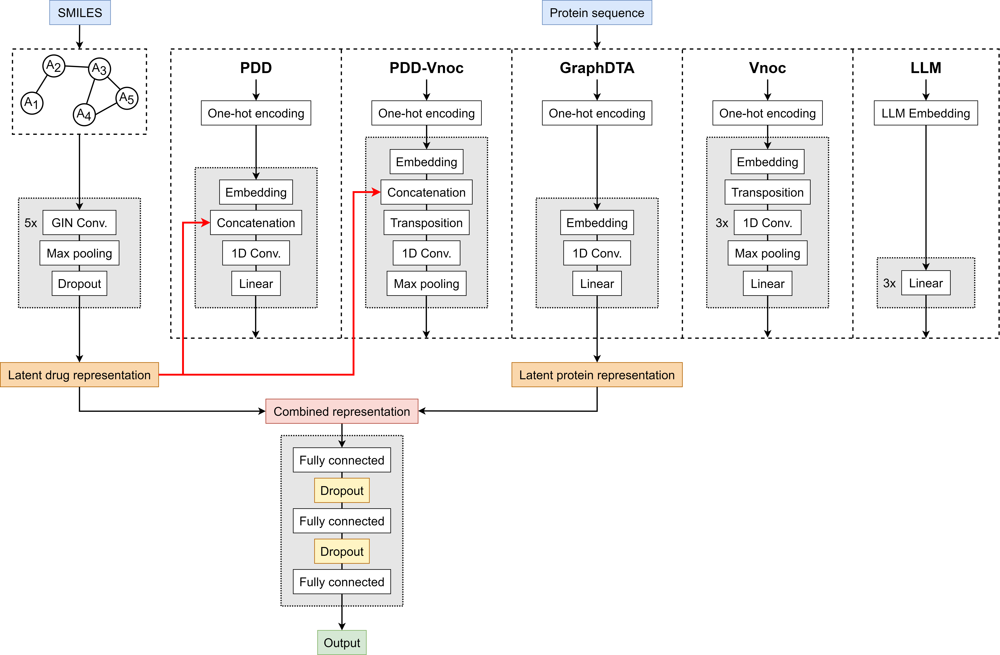

# P-GraphDTA: Enhanced protein representations improve drug–target binding affinity prediction
Implementation of different protein representation models on top of GraphDTA's drug graph neural network processing methods.

<p align="center">

</p> 

### Resources:

+ README.md: this file.
+ data/davis/\*, data/kiba/\* - These file were downloaded from https://github.com/hkmztrk/DeepDTA/tree/master/data
+ data/davis/new_proteins.json - This file was created with data from https://github.com/larngroup/DTITR/blob/main/data/davis/dataset/davis_dataset_processed.csv

### Source codes:
+ create_data.py: create data in pytorch format
+ utils.py: include TestbedDataset used by create_data.py to create data, and performance measures.
+ training.py: train a GraphDTA model.
+ models/ginconv.py, gat.py, gat_gcn.py, and gcn.py: proposed models GINConvNet, GATNet, GAT_GCN, and GCNNet receiving graphs as input for drugs.

### Preprocessing:

### Post-hoc analysis:

# Step-by-step running:

## 0. Install Python libraries needed
+ Install pytorch_geometric following instruction at https://github.com/rusty1s/pytorch_geometric
+ Install rdkit: conda install -y -c conda-forge rdkit
+ Or run the following commands to install both pytorch_geometric and rdkit:
```
conda create -n geometric python=3
conda activate geometric
conda install -y -c conda-forge rdkit
conda install pytorch torchvision cudatoolkit -c pytorch
pip install torch-scatter==latest+cu101 -f https://pytorch-geometric.com/whl/torch-1.4.0.html
pip install torch-sparse==latest+cu101 -f https://pytorch-geometric.com/whl/torch-1.4.0.html
pip install torch-cluster==latest+cu101 -f https://pytorch-geometric.com/whl/torch-1.4.0.html
pip install torch-spline-conv==latest+cu101 -f https://pytorch-geometric.com/whl/torch-1.4.0.html
pip install torch-geometric
```
+ This repository contains ```requirements.txt``` and ```environment.yml``` files for environment creation.
+ preprocessing/FRI/ contains ```fri_requirements.txt``` and ```fri_environment.yml``` for DeepFRI installation, based on the instructions at https://github.com/flatironinstitute/DeepFRI?tab=readme-ov-file#dependencies

## 1. Create data in pytorch format
Running
```sh
conda activate geometric
python create_data.py
```
This returns kiba_train.csv, kiba_test.csv, davis_train.csv, and davis_test.csv, saved in data/ folder. These files are in turn input to create data in pytorch format,
stored at data/processed/, consisting of  kiba_train.pt, kiba_test.pt, davis_train.pt, and davis_test.pt.

## 2. Train a prediction model
To train a model using training data. The model is chosen if it gains the best MSE for testing data.  
Running 

```sh
conda activate geometric
python training.py 0 0 0
```

where the first argument is for the index of the datasets, 0/1 for 'davis' or 'kiba', respectively;
 the second argument is for the index of the models, 0/1/2/3 for GINConvNet, GATNet, GAT_GCN, or GCNNet, respectively;
 and the third argument is for the index of the cuda, 0/1 for 'cuda:0' or 'cuda:1', respectively. 
 Note that your actual CUDA name may vary from these, so please change the following code accordingly:
```sh
cuda_name = "cuda:0"
if len(sys.argv)>3:
    cuda_name = "cuda:" + str(int(sys.argv[3])) 
```

This returns the model and result files for the modelling achieving the best MSE for testing data throughout the training.
For example, it returns two files model_GATNet_davis.model and result_GATNet_davis.csv when running GATNet on Davis data.

## 3. Train a prediction model with validation 

In "3. Train a prediction model", a model is trained on training data and chosen when it gains the best MSE for testing data.
This follows how a model was chosen in https://github.com/hkmztrk/DeepDTA. The result by two ways of training is comparable though.

In this section, a model is trained on 80% of training data and chosen if it gains the best MSE for validation data, 
which is 20% of training data. Then the model is used to predict affinity for testing data.

Same arguments as in "3. Train a prediction model" are used. E.g., running 

```sh
python training_validation.py 0 0 0
```

This returns the model achieving the best MSE for validation data throughout the training and performance results of the model on testing data.
For example, it returns two files model_GATNet_davis.model and result_GATNet_davis.csv when running GATNet on Davis data.
