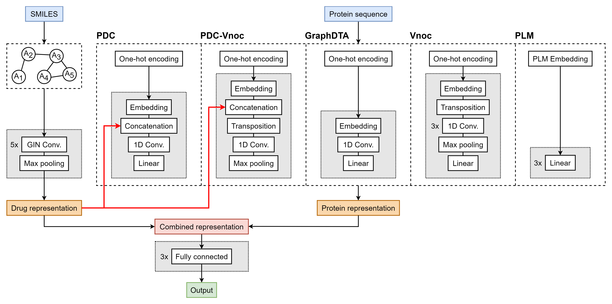

# E-GraphDTA: Enhanced protein representations improve drug–target binding affinity prediction
Implementation of five novel protein representation models on top of GraphDTA's drug graph neural network processing methods for predicting the binding affinity of drug-target pairs. The proposed methods revolve around three key concepts of protein sequence representation and interpretation:
1. Incorporating information about the drug into the target representation,
2. Redefining protein embedding convolution layers,
3. Predicting protein representations using protein language models, which include [Evolutionary Scale Modeling](https://github.com/facebookresearch/esm) and [Functional Residue Identification](https://github.com/flatironinstitute/DeepFRI).

<p align="center">

</p> 

# Installation
All environments and source codes were created and tested in a Linux environment.
All scripts and model architectures can be downloaded locally using ```git clone https://github.com/matija-marijan/E-GraphDTA.git```

## GraphDTA environment
```
conda create -n geometric python=3
conda activate geometric
conda install -y -c conda-forge rdkit
conda install pytorch torchvision -c pytorch
pip install pyg_lib torch_scatter torch_sparse torch_cluster torch_spline_conv -f https://data.pyg.org/whl/torch-2.2.1+cu118.html
pip install torch-geometric
conda install cudatoolkit -c conda-forge
pip install fair-esm
```
+ Additionally, this repository contains ```requirements.txt``` and ```environment.yml``` files for environment creation. These requirements can be installed using ```pip install requirements.txt``` or ```conda env create -f environment.yml```.
## DeepFRI environment
+ The preprocessing steps required to run and extract embeddings from DeepFRI models run in a different environment, which is not compatible with ```geometric```.
+ preprocessing/FRI/ contains ```fri_requirements.txt``` and ```fri_environment.yml``` files for DeepFRI environment creation. These requirements can be installed using ```pip install fri_requirements.txt``` or ```conda env create -f fri_environment.yml```, from ```cd preprocessing/FRI```. Additionally, the DeepFRI environment can be installed using ```pip install .``` from ```cd preprocessing/FRI```.

# Resources

## Datasets
+ data/davis/, data/kiba/ contain the Davis and KIBA drug-target interaction datasets. The files were downloaded from [DeepDTA](https://github.com/hkmztrk/DeepDTA/tree/master/data).
+ data/davis/new_proteins.json contains the updated version of the protein sequences from the Davis dataset, which have been accounted for mutations. This file was created with data downloaded from [DTITR](https://github.com/larngroup/DTITR/blob/main/data/davis/dataset/davis_dataset_processed.csv).

## Proposed Models
All of the proposed models, along with the original GraphDTA models can be found in the models/ folder. All proposed models are built on top of the GraphDTA GIN model variant, and include:
+ **PDC** (Protein-Drug Concatenation): Incorporates drug information in the protein representation learning channel, by concatenating the drug latent vector to each amino acid embedding latent vector:
  <p align="center">
  
  </p>
+ **Vnoc** (Transposed Input Convolution): Transposes the input protein embedding matrix, and performes convolution along the original protein sequence direction:
  <p align="center">
  
  </p>
+ **PDC-Vnoc** (Combined Representation): Includes both innovations from the PDC and Vnoc models.
+ **ESM**: Utilizes precomputed PLM-based protein embeddings extracted during ESM preprocessing.
+ **FRI**: Utilizes precomputed PLM-based protein embeddings extracted during DeepFRI preprocessing.

## Protein Language Models
+ The pretrained ESM model for extracting protein embeddings can be downloaded from [download link](https://dl.fbaipublicfiles.com/fair-esm/models/esm2_t6_8M_UR50D.pt), and should be moved to preprocessing/ESM/.
+ The pretrained DeepFRI models can be downloaded from [download link](https://users.flatironinstitute.org/~renfrew/DeepFRI_data/trained_models.tar.gz). The ```tar.gz``` file can be uncompressed into the preprocessing/FRI/ directory by using ```tar xvzf trained_models.tar.gz -C /path/to/GraphDTA/preprocessing/FRI```. The preprocessing/FRI/deepfrier folder contains the ```deepfrier``` modified source code from [DeepFRI](https://github.com/flatironinstitute/DeepFRI/tree/master/deepfrier), which is used for extracting embeddings during inference to create new datasets for training the updated GraphDTA models.

# Usage

## 1. Preprocessing
Before training a prediction model and analyzing its results, the input datasets need to be preprocessed into PyTorch format.
+ Create original data in PyTorch format:
  ```
  python create_data.py
  ```
+ Create data in PyTorch format with protein embeddings extracted from ESM:
  ```
  python -m preprocessing.ESM.esm_preprocessing
  ```
+ Create data in PyTorch format with protein embeddings extracted from DeepFRI:
  ```
  conda activate deepfri
  python -m preprocessing.FRI.deepfri_embeddings
  conda deactivate
  conda activate geometric
  python -m preprocessing.FRI.deepfri_preprocessing
  ```

Optional arguments:
--mutation/-x: Flag for including protein sequence mutations in the Davis dataset {False (default)}.
  
These scripts return train and test .csv files in the data/ folder, as well as train and test .pt files in the data/processed, which are to be used during training.
  
## 2. Training
A prediction model can be trained using ```python training.py``` with the following arguments:
1. --model/-m: DTA model chosen for training {'PDC_GINConvNet', 'Vnoc_GINConvNet', 'PDC_Vnoc_GINConvNet', 'ESM_GINConvNet', 'FRI_GINConvNet', 'GINConvNet', 'GATNet', 'GAT_GCN', 'GCNNet'}
2. --dataset/-d: Dataset chosen for training {'davis', 'kiba'}.
3. --cuda/-c: CUDA device index (default: 0).
4. --seed/-s: Random seed for reproducibility.
5. --mutation/-x: Flag for including protein sequence mutations in the Davis dataset {False (default)}.

Example use:
  ```
  python training.py -d davis -m PDC_Vnoc_GINConvNet -s 0
  ```
This runs the training for the PDC-Vnoc model variant on the Davis dataset, with 0 used as a random seed for reproducibility. The training and evaluation is performed using a predefined 5:1 data split.

The training script saves the best overall model checkpoint with the lowest MSE on the testing data, and continually outputs MSE on the training data, and MSE, RMSE, Spearman correlation, and Pearson correlation values on the testing data. It also calculates the Concordance Index on the test data for the best overall model at the end of training.

### Validation
A prediction model can also be trained using a three-way dataset split with the same 5:1 split for training and testing, where 20% of the training set is used independently for validation, while the remaining 80% is used for training, using the following command with the same arguments as listed above:
```
python training_validation.py -d davis -m ESM_GINConvNet
```
The validation script saves the best overall model checkpoint with the lowest MSE on the testing data, and continually outputs MSE on validation data, and MSE, RMSE, Spearman correlation, and Pearson correlation values on the testing data. It also calculates the Concordance Index on the test data for the best overall model at the end of training. 

## 3. Analysis
The analysis/ folder contains various scripts for post hoc analysis:
+ Perform inference on a trained model using testing data:
  ```
  python -m analysis.prediction -d kiba -m Vnoc_GINConvNet -s 0
  ```
  This code saves the results in .csv format in the analysis/predictions/ folder. It uses identical arguments as ```training.py``` for dataset, model, CUDA device, random seed, and mutation flag selection.
+ Calculate total median absolute error contribution of drugs and proteins, for calculated predictions:
  ```
  python -m analysis.error_contribution -d davis -m FRI_GINConvNet
  ```
  This code saves figures for the drug and protein contributors to total prediction error as .png files in the images/error contribution/ folder. Additionally, this code saves the top 10 drug and protein contributors to total prediction error as .json files in the analysis/prediction/annotations folder.
+ Perform protein embedding interpretability analysis:

  Extract protein parameters from [ProtParam](https://web.expasy.org/protparam/):
  ```
  python -m analysis.protein_characteristics
  ```
  This saves the extracted 30 protein parameters for the testing set in a .csv file in the analysis/interpretability/protein_parameters/ folder.
  
  Extract protein embeddings from final protein representation learning layers:
  ```
  python -m analysis.extract_embeddings -d kiba -m PDC_GINConvNet
  ```
  This saves the extracted 128-dimensional protein embeddings for the testing set in a .csv file in the analysis/interpretability/protein_embeddings/ folder. This code uses arguments for dataset, model, CUDA device, random seed, and protein sequence mutation flag selection.

  Perform canonical correlation analysis between the extracted protein embeddings and parameters:
  ```
  python -m analysis.interpretability -d davis -m ESM_GINConvNet
  ```
  This saves a 2-dimensional plot of the CCA projections and singular vectors of the embeddings and parameters, to a .png file in the analysis/interpretability/ folder. This script uses arguments for dataset, model, and protein mutation flag selection.
